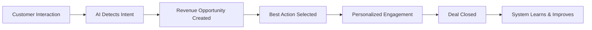
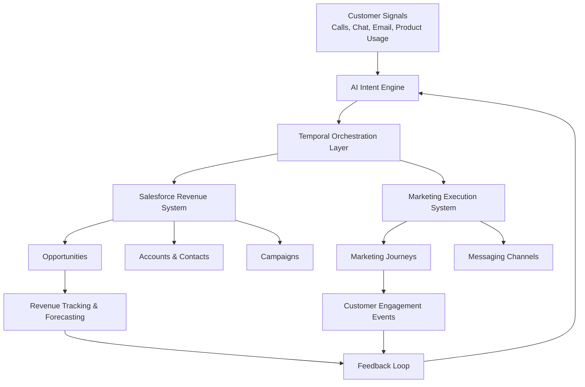
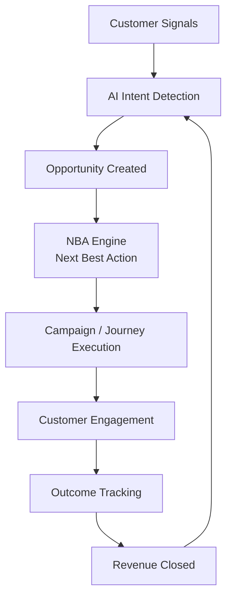
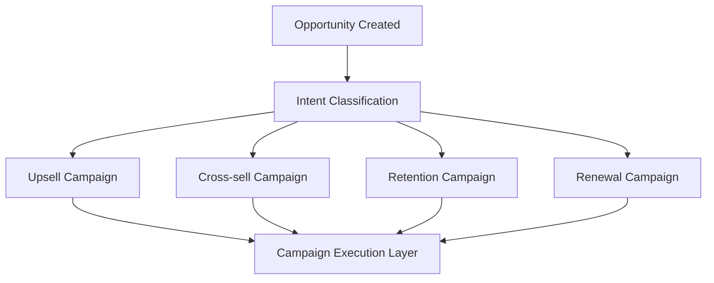
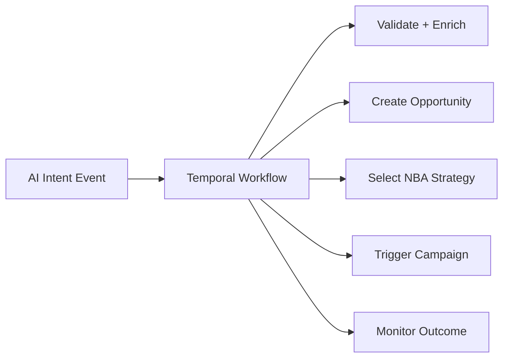
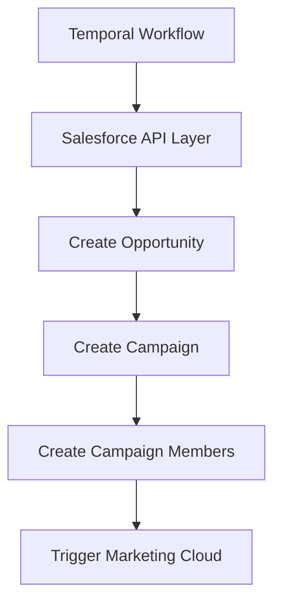
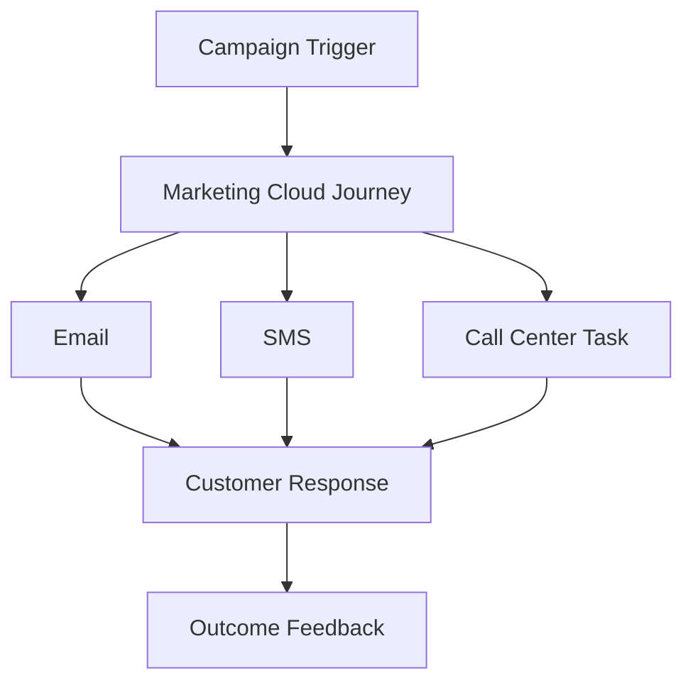
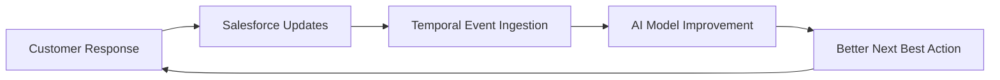

## AI-Driven Revenue Acceleration Platform

This solution transforms every customer interaction into a real-time revenue optimization system.

Instead of traditional CRM processes where marketing campaigns generate leads, this model starts with **real customer intent** and automatically converts it into revenue opportunities, then uses AI-driven decisioning to determine the best action to maximize conversion and margin.

It creates a **closed-loop revenue system** where:

* AI detects intent
* Revenue opportunities are created instantly
* Best action is selected dynamically
* Marketing and sales execute coordinated engagement
* Outcomes continuously improve future decisions

---

## 💡 Business Value

* Faster opportunity creation (real-time from customer signals)
* Higher conversion rates (AI-driven personalization)
* Reduced discount leakage (value-based offers instead of blanket discounts)
* Increased revenue per customer
* Lower manual effort across sales and marketing
* Full visibility into revenue attribution and performance

---

## 🔁 Simple Business Flow



---

# 🟡 2. End-to-End Revenue Architecture (Enterprise View)

## Core Design Principle

> AI drives decisions, Temporal orchestrates execution, Salesforce stores revenue truth, and Marketing executes engagement.

---



---

## 🧠 Key Roles

| Component       | Role                                  |
| --------------- | ------------------------------------- |
| AI Engine       | Detects intent & predicts opportunity |
| Temporal        | Orchestrates revenue workflows        |
| Salesforce      | System of record for revenue          |
| Marketing Cloud | Executes customer engagement          |
| Feedback Loop   | Improves future decisions             |

---

# 🟡 3. Core Revenue Lifecycle (Step-by-Step)

---

## Step 1 — Capture Customer Signals

Customer data is continuously captured from:

* Calls (call transcripts)
* Emails
* Chat interactions
* Website / app behavior
* Product usage signals

---

## Step 2 — AI Intent Detection

AI analyzes interactions to detect:

* Upsell opportunity
* Cross-sell opportunity
* Renewal risk
* Churn risk

Each intent is scored based on:

* Revenue potential
* Confidence level
* Customer value tier
* Urgency

---

## Step 3 — Opportunity Creation (Revenue Entry Point)

When intent passes threshold:

* A structured revenue opportunity is created in Salesforce
* Opportunity becomes the **single source of revenue truth**

Includes:

* Estimated value
* Probability
* Intent type
* Priority
* Recommended action

---

## Step 4 — Next Best Action (Revenue Optimization Layer)

System determines optimal strategy:

* Best offer (discount / bundle / upgrade / service)
* Best channel (email, SMS, sales call)
* Best timing
* Best message

👉 Focus: **maximize conversion + protect margin**

---

## Step 5 — Execution via Campaigns & Journeys

Engagement is executed using Salesforce Marketing Cloud:

* Email journeys
* SMS / WhatsApp
* Sales tasks
* Automated nurturing flows

---

## Step 6 — Closed-Loop Learning

Every interaction feeds back into the system:

* Opportunity updates (stage progression)
* Campaign effectiveness tracking
* Revenue attribution
* AI model improvement

---

## 🔁 Revenue Lifecycle Diagram



---

# 🟡 4. Opportunity-Led Marketing Model (Key Differentiator)

## Traditional CRM

```text
Campaign → Lead → Opportunity → Revenue
```

## This Solution (AI-driven)

```text
Intent → Opportunity → NBA → Campaign → Conversion
```

---

## Key Insight

* Campaigns are no longer discovery tools
* Campaigns become **execution accelerators for revenue opportunities**

---

## Campaign Logic



---

# 🟡 5. System Orchestration Model (Temporal Layer)

Temporal acts as the **revenue orchestration brain**

It ensures:

* workflows are deterministic
* retries are handled safely
* business rules are enforced
* systems are coordinated

---

## Temporal Responsibilities

* Validate AI intent
* Decide opportunity creation
* Select campaign strategy
* Orchestrate Salesforce updates
* Trigger marketing journeys
* Monitor outcomes

---

## Orchestration Flow



---

# 🔵 6. Implementation View (Engineering Layer)

## Salesforce Objects Used

* Opportunity → revenue tracking
* Campaign → execution grouping
* CampaignMember → audience mapping
* CampaignInfluence → attribution

---

## Execution Pattern



---

## Marketing Execution



---

## Closed-Loop Learning



---

# 🟣 7. Final Business Impact Summary

This architecture enables:

## Revenue Growth

* Higher conversion rates
* Increased upsell/cross-sell success

## Margin Optimization

* Reduced unnecessary discounting
* Value-based offers per customer

## Speed

* Real-time opportunity creation
* Faster sales cycles

## Efficiency

* Reduced manual workload
* Automated campaign execution

## Intelligence

* Continuous learning from outcomes
* AI-driven decision improvement

---

# 🟣 8. One-Line Executive Summary

> “This platform uses AI to convert customer interactions into real-time revenue opportunities and orchestrates personalized engagement through Salesforce and Marketing Cloud using a closed-loop, Next Best Action-driven revenue optimization engine powered by Temporal.”
