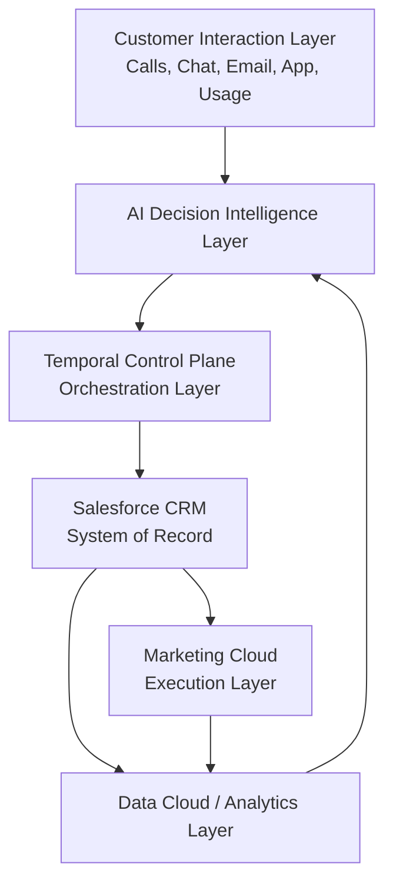
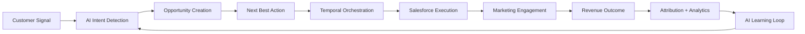
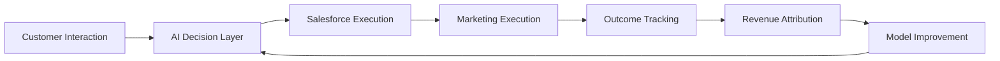
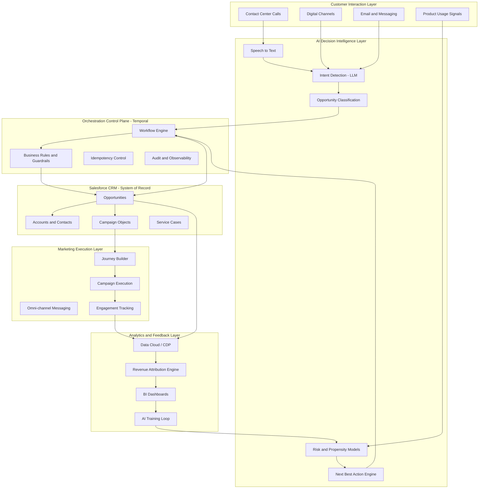
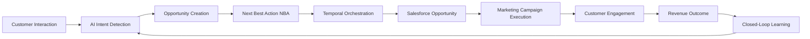
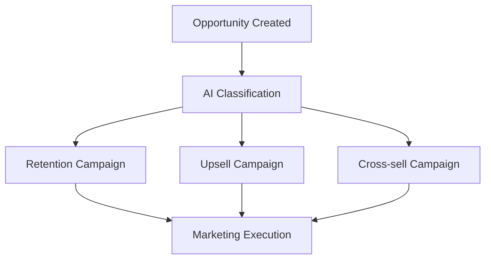
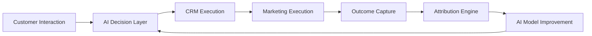
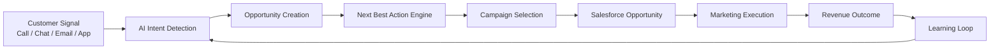
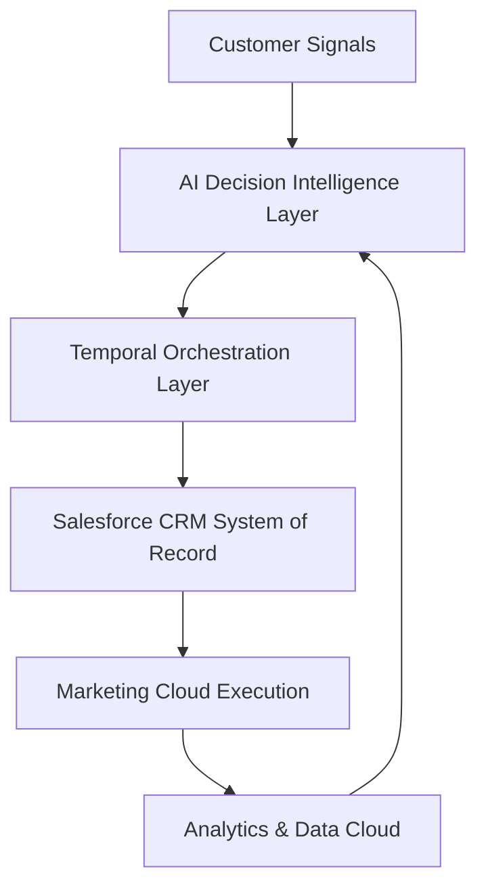
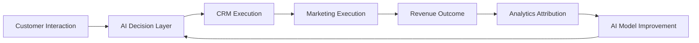

# 🚀 AI-Driven Revenue Decision Intelligence Platform

## *A Revenue Control Plane for Salesforce-Centric Enterprises*

---

# 1. Executive Summary (Why This Matters Now)

Enterprises are entering a new operating reality where customer expectations are real-time, but revenue systems remain batch-driven, fragmented, and reactive.

Despite massive investments in Salesforce CRM, Marketing Cloud, and analytics platforms, most organizations still suffer from a fundamental gap:

> **Customer intent is captured in real time — but revenue action happens too late.**

This delay between **signal → decision → execution** results in lost revenue, inconsistent customer experiences, and inefficient marketing spend.

---

## 🔴 Why Now (Critical Market Shift)

Three enterprise shifts are making this problem urgent:

### 1. GenAI has unlocked real-time decision intelligence

LLMs can now interpret unstructured customer interactions at scale.

### 2. CRM is becoming a system of execution — not intelligence

Salesforce stores data, but does not natively orchestrate real-time AI decisions across workflows.

### 3. Revenue is moving to “intent-driven systems”

Winning enterprises are shifting from campaign-led to **signal-led revenue systems**.

---

## 🎯 This Platform Introduces

A **Revenue Decision Intelligence Layer** that sits above Salesforce to:

* detect customer intent in real time
* generate structured revenue opportunities
* recommend next-best-actions
* orchestrate governed execution
* continuously learn from outcomes

---

## 🔁 Transformation

> From **reactive CRM execution**
> → to **real-time AI-driven revenue orchestration**

---

# 2. Enterprise Problem (Structural Breakdown)

| Breakdown Area      | Enterprise Challenge            | Business Impact                   |
| ------------------- | ------------------------------- | --------------------------------- |
| Customer Signals    | Unstructured interactions       | Lost revenue opportunities        |
| Decisioning         | No real-time intelligence layer | Slow response cycles              |
| CRM Updates         | Manual / inconsistent entry     | Poor data integrity               |
| Marketing Execution | Siloed campaigns                | Low personalization effectiveness |
| Attribution         | Weak linkage to revenue         | No ROI visibility                 |
| Learning Loop       | No feedback-driven optimization | Static performance                |

---

# 3. Solution Overview

## 🧠 Core Idea

> Introduce an **AI-native decision intelligence layer** that converts customer signals into governed revenue actions.

---

## 🏗 System Capabilities

### 1. Real-time Revenue Signal Detection

* churn risk
* upsell opportunity
* cross-sell potential
* competitive exposure

### 2. Structured Opportunity Generation

* Salesforce-ready opportunity objects
* normalized revenue metadata
* deterministic fields + AI enrichment

### 3. Next Best Action Intelligence

* retention strategy selection
* offer optimization
* engagement channel selection

### 4. Campaign Recommendation Layer (NOT execution)

* maps intent → campaign strategy
* governed by enterprise rules

### 5. Closed-loop Learning System

* continuously improves AI decisions based on outcomes

---

# 4. Target Architecture (Enterprise Reference Model)



---

# 5. Control Plane vs Data Plane Architecture (Critical Differentiator)

## 🧠 Control Plane (This Platform)

Responsible for **deciding and orchestrating revenue actions**

* AI Decision Intelligence
* Next Best Action Engine
* Temporal Workflow Orchestration
* Business Rules & Guardrails
* Idempotency Control

---

## 🧾 Data Plane (Enterprise Systems)

Responsible for **storing and executing truth**

* Salesforce CRM (Opportunities, Accounts, Campaigns)
* Marketing Cloud (Journeys, Messaging)
* Data Cloud (Analytics, Customer 360)

---

## ⚠️ Core Principle

> AI decides. Control plane orchestrates. Data plane executes. CRM records truth.

---

# 6. End-to-End Revenue Flow (Unified View)



---

# 7. Core Intelligence Components

---

## 7.1 AI Intent Detection Engine

### Function

Classifies unstructured customer interactions into structured revenue intent.

### Output

```json
{
  "intent": "Retention",
  "confidence": 0.94
}
```

---

## 7.2 Opportunity Extraction Engine

Transforms conversation → CRM-ready structured object.

* churn driver
* urgency score
* intent strength
* revenue potential

---

## 7.3 Next Best Action Engine

### Output Examples

* PRICE_OBJECTION_RETENTION
* VIP_RECOVERY_STRATEGY
* DEVICE_UPGRADE_PATH

👉 AI = recommendation layer only

---

## 7.4 Campaign Mapping Layer

```text
NBA Signal → Governed Campaign Mapping
```

Example:

* PRICE_OBJECTION_RETENTION → PRICE_SAVE_CAMPAIGN

👉 Execution remains in Marketing Cloud

---

# 8. Salesforce Integration Model

## Salesforce remains:

### 🧾 System of Record

* Opportunities
* Accounts
* Campaigns

### ⚙️ Execution Layer

* Campaigns
* Journeys
* Customer engagement

---

## This platform adds:

### 🧠 Missing Layer in Salesforce today:

> Real-time decision intelligence + orchestration brain

---

# 9. Closed-Loop Revenue Intelligence System



---

# 10. Temporal Orchestration Layer

## Why it matters

Salesforce Flow and CRM automation are:

* event-driven
* limited in AI orchestration capability
* weak in multi-step decision workflows

---

## Temporal provides:

* deterministic execution
* retry safety
* full auditability
* long-running workflows
* idempotent CRM operations

---

# 11. Competitive Differentiation (Critical Section)

## vs Salesforce Native Stack

| Capability                | Salesforce Native | This Platform               |
| ------------------------- | ----------------- | --------------------------- |
| Real-time AI decisioning  | Limited           | Core capability             |
| Multi-step orchestration  | Partial (Flow)    | Full Temporal control plane |
| Cross-system intelligence | Weak              | Unified decision layer      |
| Closed-loop learning      | Basic analytics   | Continuous AI feedback loop |
| Deterministic governance  | Partial           | Full enterprise control     |

---

## Key Insight

> Salesforce is the system of record.
> This platform becomes the system of decision.

---

# 12. Business Impact

## 📈 Revenue Impact

* +10–25% conversion uplift
* improved retention rates
* higher upsell success

---

## 💰 Margin Impact

* reduced discount leakage
* optimized offer personalization
* improved pricing discipline

---

## ⚙️ Operational Impact

* reduced manual CRM work
* faster response to customer signals
* automated campaign targeting

---

## 🧠 Strategic Impact

* unified revenue intelligence layer
* continuous learning system
* predictive revenue optimization

---

# 13. Industry Use Cases

## Telecom

* churn prevention
* plan upgrades
* retention offers

## Banking

* credit upsell
* wealth advisory
* cross-sell optimization

## Insurance

* renewal optimization
* bundle expansion
* risk-based retention

## Utilities

* billing retention
* service plan optimization

---

# 14. Final Executive Positioning

> This platform introduces a **real-time AI-driven Revenue Decision Intelligence Layer** that transforms customer intent into governed revenue actions by orchestrating Salesforce CRM and Marketing Cloud through a deterministic control plane and continuous closed-loop learning system.

---
# 🚀 AI-Driven Revenue Decision Intelligence Platform

## *A Real-Time Closed-Loop Revenue Orchestration System (Salesforce-Centric)*

---

# 1. Executive Summary

Enterprises today generate large volumes of customer interaction data across contact centers, digital channels, and service systems. However, this data is rarely converted into **real-time, structured revenue actions**, resulting in delayed engagement, inconsistent customer experiences, and lost monetization opportunities.

This platform introduces a **real-time AI-driven Revenue Decision Intelligence Layer** that sits above Salesforce CRM and Marketing Cloud to continuously convert customer intent into structured opportunities and governed actions.

It does not replace CRM or marketing systems.

Instead, it enables them by introducing a **decision intelligence + orchestration control plane**.

---

## 🔁 Transformation

> From **reactive CRM execution**
> → to **proactive, AI-orchestrated revenue decisioning**

---

# 2. Core System Philosophy (Critical for Enterprise Trust)

## 🧠 Three-Layer Operating Model

| Layer                                                | Role                                 |
| ---------------------------------------------------- | ------------------------------------ |
| 🧠 AI Decision Layer                                 | Generates insights & recommendations |
| ⚙️ Orchestration Layer (Temporal)                    | Controls execution flow              |
| 🧾 Enterprise Systems (Salesforce + Marketing Cloud) | Execute + store system of record     |

---

## ⚠️ Key Governance Principle

> AI never directly owns execution.
> It only produces **structured decision intelligence**.

---

# 3. Enterprise Architecture (Unified View)



---

# 4. End-to-End Revenue Process Flow (Core Value Chain)



---

# 5. Operating Model (Sense → Understand → Decide → Orchestrate → Execute → Learn)

---

## 5.1 Sense (Customer Signal Capture)

Sources:

* Contact center calls
* Chat / messaging
* Email interactions
* Digital behavior
* Product telemetry

---

## 5.2 Understand (AI Intelligence Layer)

AI identifies:

* Churn risk
* Upsell opportunity
* Cross-sell signals
* Competitive threats
* Customer dissatisfaction

### Output

```json id="intent_output"
{
  "intent_type": "Retention",
  "confidence": 0.93,
  "risk_level": "High"
}
```

---

## 5.3 Decide (Next Best Action Engine)

AI recommends:

* Best offer
* Best timing
* Best channel
* Best messaging strategy

⚠️ AI is **advisory only**

---

## 5.4 Orchestrate (Temporal Control Plane)

Ensures:

* deterministic execution
* retry safety
* audit logs
* business rule enforcement

---

## 5.5 Execute (Enterprise Systems)

### Salesforce CRM

* Opportunity creation
* Account updates
* Campaign mapping

### Marketing Cloud

* Journey execution
* Customer engagement
* Messaging orchestration

---

## 5.6 Learn (Feedback Loop)

System continuously improves via:

* conversion tracking
* campaign performance
* revenue attribution
* AI retraining signals

---

# 6. Opportunity-Led Revenue Model (Key Differentiator)

## Traditional CRM Flow

```text
Campaign → Lead → Opportunity → Revenue
```

## This Platform (AI-Native Flow)

```text
Intent → Opportunity → NBA → Campaign → Revenue → Learning Loop
```

---

# 7. Campaign Decisioning Layer



---

# 8. Control Plane vs Data Plane Architecture (Critical Enterprise Section)

## 🧠 Control Plane (Decision & Orchestration)

* AI Decision Layer
* Temporal Workflow Engine
* Business Rules Engine

👉 Responsible for:

* deciding what should happen
* orchestrating execution
* enforcing governance

---

## 🧾 Data Plane (System of Record)

* Salesforce CRM
* Marketing Cloud
* Data Cloud

👉 Responsible for:

* storing truth
* executing customer engagement
* tracking outcomes

---

## ⚠️ Core Principle

> AI never writes directly to the data plane without orchestration validation.

---

# 9. Closed-Loop Intelligence System



---

# 10. Example Scenario (End-to-End)

### Customer Statement

> “Your competitor is offering a cheaper plan.”

---

### AI Output

```json id="ai_out"
{
  "intent": "Retention",
  "driver": "PRICE",
  "confidence": 0.94
}
```

---

### NBA Output

```json id="nba_out"
{
  "strategy": "PRICE_OBJECTION_RETENTION"
}
```

---

### Execution Flow

1. Temporal creates workflow
2. Salesforce Opportunity is created
3. Campaign is mapped
4. Marketing journey is triggered
5. Customer engages
6. Revenue is realized
7. System learns

---

# 11. Business Impact

## 📈 Revenue Growth

* Higher conversion rates
* Improved retention
* Better upsell execution

---

## 💰 Margin Optimization

* Reduced discount leakage
* Value-based offers
* Pricing discipline

---

## ⚙️ Operational Efficiency

* Automated CRM updates
* Reduced manual intervention
* Faster response cycles

---

## 🧠 Strategic Intelligence

* unified customer intelligence
* continuous learning loop
* predictive revenue optimization

---
# 📊 AI-Driven Revenue Decision Intelligence Platform

## Salesforce Partner Pitch Deck (10–12 Slides)

---

# 🟦 Slide 1 — Title

## AI-Driven Revenue Decision Intelligence Platform

### A Real-Time Closed-Loop Revenue Orchestration Layer for Salesforce

**Tagline:**

> Transform customer intent into structured revenue actions using AI, orchestration, and Salesforce-native execution systems.

---

# 🟦 Slide 2 — Executive Problem Statement

## Enterprises are rich in data, but poor in real-time revenue action

### Key challenges:

* Customer intent is captured too late or not at all
* CRM systems are manually updated and inconsistent
* Marketing and sales operate in silos
* No real-time decisioning layer exists
* Attribution is fragmented across systems

---

## Business impact

> Revenue opportunities are lost between “customer signal” and “enterprise action”

---

# 🟦 Slide 3 — Market Reality

## Traditional CRM is execution-centric, not decision-centric

```text
Campaign → Lead → Opportunity → Revenue
```

### Limitations:

* Reactive engagement
* Static segmentation
* Manual orchestration
* Weak personalization at scale

---

## Gap

> There is no AI-native decision intelligence layer above CRM

---

# 🟦 Slide 4 — Solution Overview

## We introduce a Revenue Decision Intelligence Layer

A system that sits above Salesforce to:

* AI Detect customer intent 
* Generate structured revenue opportunities
* Recommend next best actions
* Orchestrate execution via governed workflows
* Continuously learn from outcomes



---

## Transformation

```text
Reactive CRM → AI-Driven Revenue Orchestration
```

---

# 🟦 Slide 5 — Target Architecture (High-Level)



---

## Core principle:

> AI decides → Temporal controls → Salesforce executes → Analytics learns

---

# 🟦 Slide 6 — AI Decision Intelligence Layer

## Converts unstructured signals into structured revenue intelligence

### Capabilities:

* Intent detection (churn, upsell, cross-sell)
* Opportunity classification
* Customer risk scoring
* Next Best Action generation

---

### Output example:

```json
{
  "intent": "Retention",
  "confidence": 0.93,
  "risk": "High"
}
```

---

# 🟦 Slide 7 — Next Best Action Engine

## AI-driven revenue optimization logic

### Produces:

* Retention strategy recommendations
* Upsell / cross-sell pathways
* Offer personalization logic
* Channel and timing recommendations

---

## Important principle:

> NBA = Recommendation layer (NOT execution layer)

---

# 🟦 Slide 8 — Orchestration Layer (Temporal)

## Enterprise-grade control plane for AI-driven decisions

### Responsibilities:

* Deterministic workflow execution
* Retry-safe processing
* Idempotent CRM operations
* Full auditability
* Business rule enforcement

---

## Why it matters:

> Ensures AI operates within enterprise governance boundaries

---

# 🟦 Slide 9 — Salesforce Execution Layer

## System of Record + Engagement Engine

### Salesforce Sales Cloud:

* Opportunity creation
* Account & Contact management
* Revenue tracking

### Salesforce Marketing Cloud:

* Journey Builder execution
* Campaign orchestration
* Multi-channel engagement

---

## Key principle:

> Salesforce is the system of record, not the system of decision

---

# 🟦 Slide 10 — Closed-Loop Revenue Intelligence



---

## Outcome:

* Every interaction improves future decisions
* Revenue system becomes self-learning

---

# 🟦 Slide 11 — Business Impact

## Revenue Growth

* Higher conversion rates
* Increased upsell & cross-sell
* Improved retention outcomes

## Margin Optimization

* Reduced discount leakage
* Value-based offers
* Better pricing discipline

## Operational Efficiency

* Automated CRM updates
* Reduced manual campaign targeting
* Faster response cycles

## Strategic Intelligence

* Unified customer intelligence layer
* Continuous learning loop
* Predictive revenue system

---

# 🟦 Slide 12 — Salesforce Value Proposition

## What it adds to Salesforce:

* 🧠 Decision Intelligence Layer (missing today)
* ⚙️ External orchestration (Temporal control plane)
* 🔁 Closed-loop learning system
* 📊 AI-native revenue optimization engine


---

## Final positioning statement:

> This solution transforms Salesforce from a system of record into a system of continuous revenue intelligence and AI-driven decision orchestration.

---
