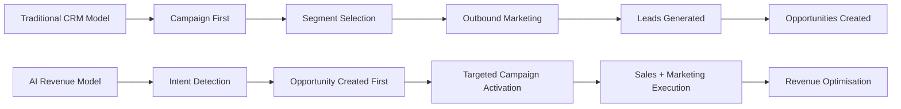
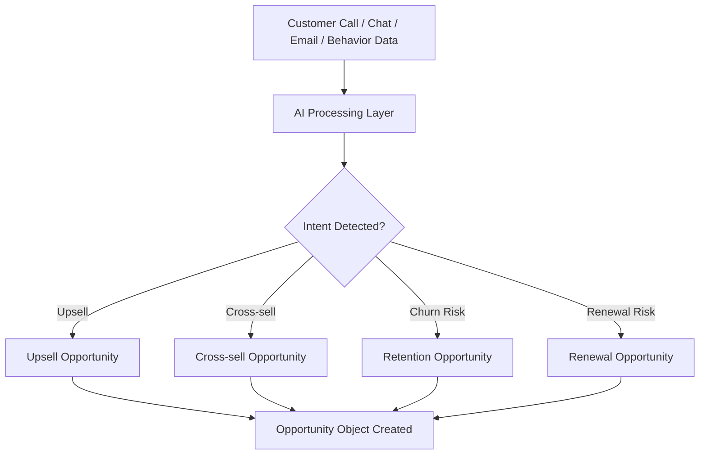
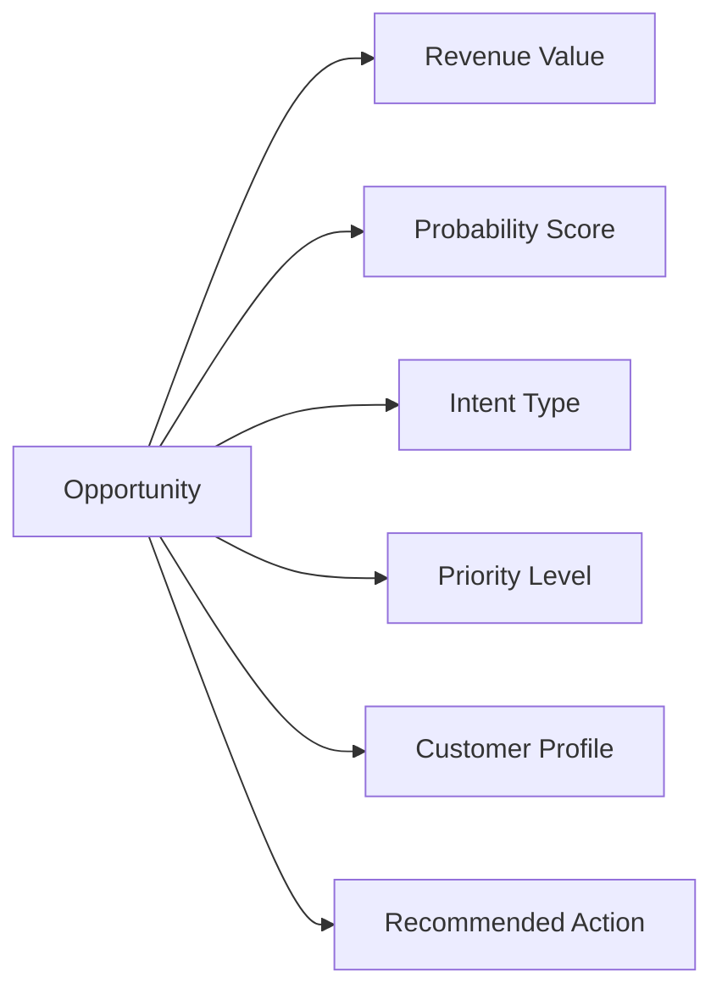
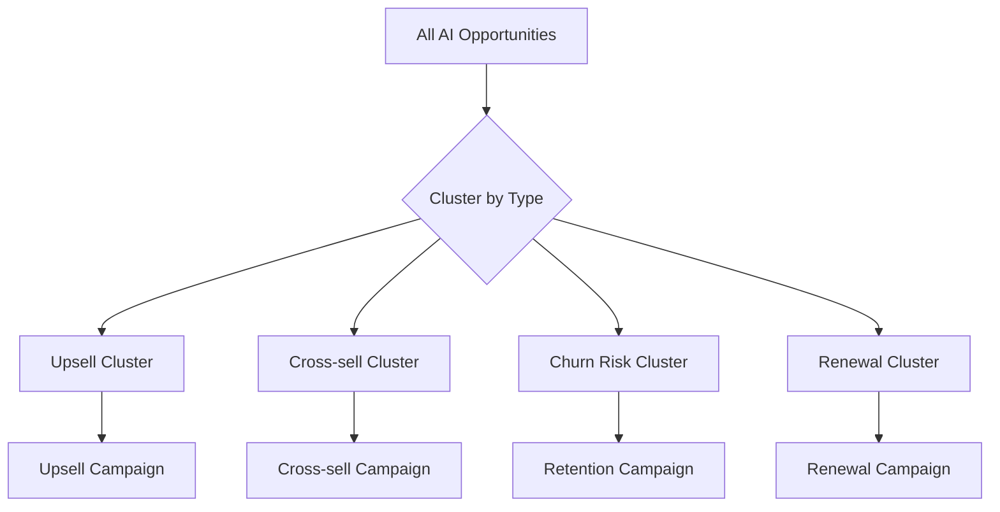
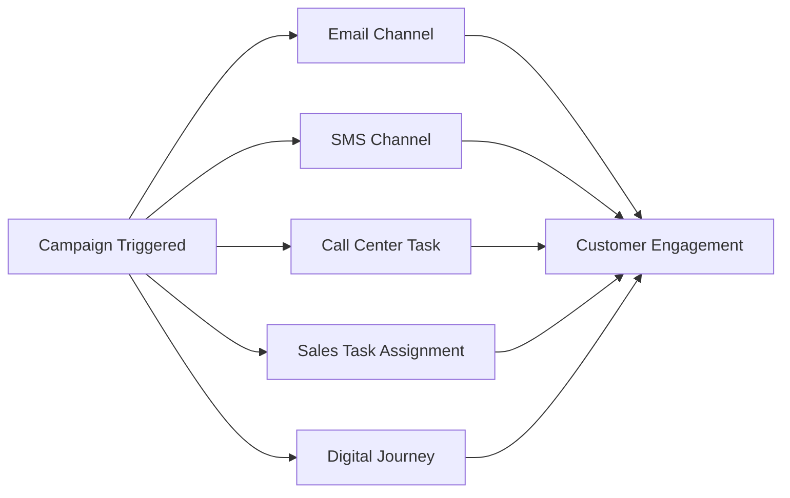
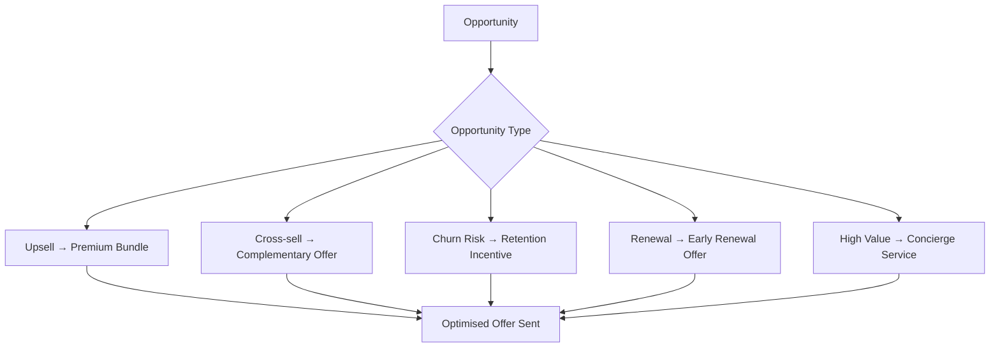
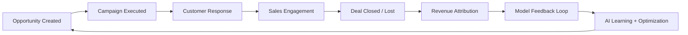
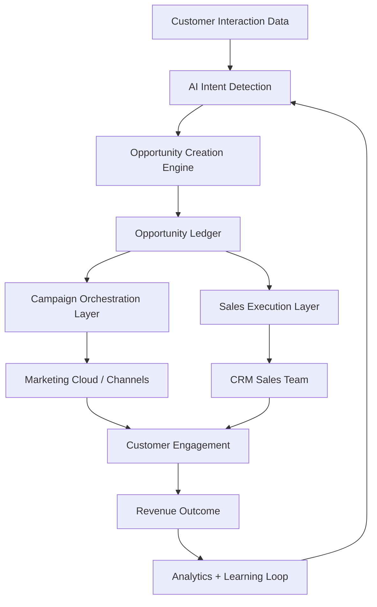
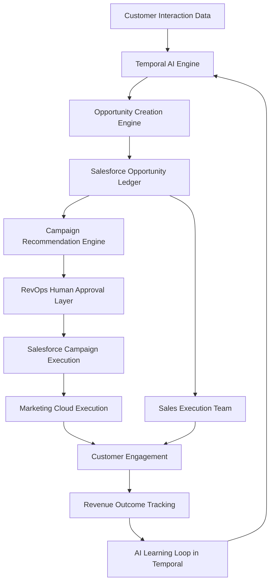

# AI-Driven Revenue Orchestration Solution (Opportunity-Led Growth Model)

## 1. Executive Summary

This solution transforms traditional CRM-driven marketing into an **AI-powered revenue optimisation system** where customer intent is detected in real time and converted into actionable revenue opportunities.

Instead of starting with marketing campaigns and pushing messages to broad segments, the system starts with **real customer intent signals** (e.g., call transcripts, digital behaviour, service interactions) and generates:

* Cross-sell opportunities
* Upsell opportunities
* Retention opportunities
* Renewal acceleration opportunities

These opportunities become the **primary driver of revenue execution**, while marketing shifts from mass outreach to **precision conversion support**.

This approach significantly increases:

* Revenue per customer
* Conversion rates
* Customer retention
* Marketing ROI
* Sales efficiency

---

## 2. Business Problem with Traditional CRM

In traditional CRM models (e.g., Salesforce / SAP CRM), the flow is typically:

**Campaign → Segment → Outreach → Leads → Opportunities**

### Key limitations:

* Mass campaigns lead to **over-discounting**
* Weak link between customer intent and offer strategy
* Opportunities are discovered late in the journey
* Marketing is not aligned to real-time customer intent
* Revenue optimisation is reactive, not proactive

Result:

* High marketing spend
* Low conversion efficiency
* Discount-driven sales closure
* Missed upsell opportunities

---

## 3. Proposed Solution: Opportunity-Led Revenue Model

### Core Shift in Strategy

The new model reverses the flow:

> **AI detects intent → Opportunity is created → Marketing executes targeted conversion strategy**

This makes the Opportunity the **central revenue object**, not the campaign.

---

## 4. End-to-End Business Flow

### Step 1: Real-Time Customer Signal Capture

Customer interactions are continuously captured from:

* Call transcripts
* Chat conversations
* Email interactions
* Product usage signals
* Service tickets

---

### Step 2: AI-Based Intent Detection

AI models analyse interactions to identify:

* Upsell intent (“customer may upgrade plan”)
* Cross-sell intent (“customer needs additional product”)
* Churn risk (“customer dissatisfaction detected”)
* Renewal risk (“contract at risk”)

Each signal is scored based on:

* Revenue potential
* Probability of conversion
* Urgency
* Customer lifetime value impact

---

### Step 3: Opportunity Creation (Revenue Entry Point)

For every qualified intent, the system automatically creates a structured:

**Salesforce Opportunities** record in Salesforce

Each opportunity includes:

* Estimated revenue value
* Probability score
* Intent type (upsell / churn / renewal / cross-sell)
* Priority level
* Recommended action

This becomes the **single source of truth for revenue tracking**.

---

### Step 4: Opportunity Enrichment & Segmentation

Opportunities are enriched with:

* Customer value tier
* Price sensitivity
* Risk profile
* Product affinity
* Conversion likelihood

This enables **dynamic opportunity grouping**, replacing static segmentation.

---

### Step 5: Marketing Campaign Activation (Support Layer)

Instead of initiating campaigns first, campaigns are now created to **support opportunity conversion**.

Campaigns in Salesforce Campaigns are used as:

* Execution vehicles for outreach
* Multi-channel engagement engines
* Conversion acceleration mechanisms

Each campaign is aligned to opportunity clusters such as:

* High-value upsell opportunities
* Churn prevention group
* Renewal acceleration group

---

### Step 6: Personalized Value Proposition Engine

Each opportunity receives a tailored strategy:

| Opportunity Type    | Value Strategy                     |
| ------------------- | ---------------------------------- |
| Upsell              | Premium bundle, feature upgrade    |
| Cross-sell          | Complementary product offer        |
| Churn risk          | Retention offer + service recovery |
| Renewal             | Early renewal incentive            |
| High-value customer | Concierge service (no discount)    |

### Key principle:

> Discounts are used selectively — not as default.

This protects margin while improving conversion rates.

---

### Step 7: Multi-Channel Execution

Execution is triggered via:

* Email
* SMS
* Call center tasks
* Sales follow-ups
* Digital journeys

Through systems like Salesforce Marketing Cloud or orchestration layers.

---

### Step 8: Closed-Loop Revenue Tracking

Every opportunity is tracked through:

* Stage progression
* Campaign influence
* Channel effectiveness
* Revenue outcome

This enables full visibility into:

* Which signals generate revenue
* Which campaigns actually convert
* Which offers maximise margin

---

## 5. Key Business Benefits

### 1. Revenue Maximisation

* Higher conversion rates through intent-based targeting
* Increased upsell and cross-sell success
* Reduced reliance on blanket discounts

---

### 2. Margin Protection

* Discounting becomes targeted, not mass-based
* High-value customers receive premium offers instead of price cuts

---

### 3. Faster Sales Cycles

* Opportunities created immediately after intent detection
* Sales teams engage earlier in the buying journey

---

### 4. Improved Customer Experience

* Relevant offers instead of generic campaigns
* Reduced spam and irrelevant messaging

---

### 5. Marketing Efficiency

* Campaigns are focused on **conversion support**, not discovery
* Higher ROI per campaign

---

### 6. True Revenue Operations Alignment

Marketing + Sales + Service operate on a shared system of opportunities rather than disconnected campaigns and leads.

---

## 6. Strategic Differentiator

This model shifts the organisation from:

### Traditional CRM

“Marketing finds customers → Sales converts → Revenue tracked after”

to:

### AI Revenue Orchestration

“AI identifies revenue opportunity → System activates conversion → Marketing + Sales execute together”

---

## 7. Conclusion

This solution represents a transition from **campaign-driven marketing** to **opportunity-driven revenue optimisation**.

It enables organisations to:

* Monetise intent in real time
* Increase revenue per customer
* Reduce wasted marketing spend
* Improve decision-making on offers and discounts
* Build a unified revenue execution system across AI, marketing, and sales

---
# AI-Driven Revenue Orchestration Solution (with Visual Flows)
## 1. Traditional CRM vs AI Revenue Model (Big Picture)

### Key Message:

* Traditional = marketing-led
* New model = revenue-led (opportunity-first)

---

## 2. Customer Signal → AI Intent Detection → Opportunity Creation

### Key Message:

* Opportunities are created from real customer intent, not marketing lists

---

## 3. Opportunity Structure (Revenue Core Object)

### Key Message:

* Opportunity = structured revenue intelligence unit

---

## 4. Opportunity Clustering → Campaign Creation

### Key Message:

* Campaigns are derived from opportunities (reverse of traditional CRM)

---

## 5. Campaign Execution (Multi-Channel Engagement)

### Key Message:

* Campaign = execution layer, not decision layer

---

## 6. Personalized Value Proposition Engine

### Key Message:

* No blanket discounts → every offer is optimized per opportunity

---

## 7. Closed-Loop Revenue Tracking

### Key Message:

* System continuously improves revenue decisions

---

## 8. Full End-to-End Architecture (Executive View)

### Key Message:

* Single unified revenue system
* Marketing + Sales = execution layers
* AI = decision engine

---

# Final Positioning Statement (for client pitch)

This architecture enables a shift from:

> “Campaign-driven marketing system”

to

> “AI-driven revenue orchestration system where every customer intent becomes a monetized opportunity and every opportunity is executed with precision, not mass marketing.”

---

