# AI-Driven Revenue Orchestration Solution 

---

# 1. Executive Summary

This solution modernizes CRM into an **AI-driven Revenue Orchestration System** where customer intent is detected in real time and converted into structured revenue opportunities.

Instead of starting with marketing campaigns, the system starts with:

> **Customer intent → Opportunity creation → Revenue strategy recommendation → Human-approved campaign execution**

### Core outcomes:

* Higher revenue per customer
* Better conversion rates
* Reduced discount dependency
* Faster opportunity identification
* Improved marketing ROI through precision targeting

---

# 2. Reality of Traditional CRM (Current State)

In systems like Salesforce or SAP CRM, the typical flow is:

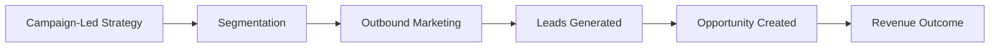

### Key limitations:

* Marketing starts without real intent
* Opportunities appear late
* Over-segmentation + low personalization
* Discount-driven conversion
* Weak linkage between intent and offer strategy

---

# 3. Target Operating Model (AI Revenue Orchestration)

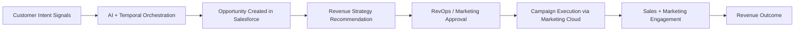

---

# 4. Customer Signal → AI Intent Detection → Opportunity Creation

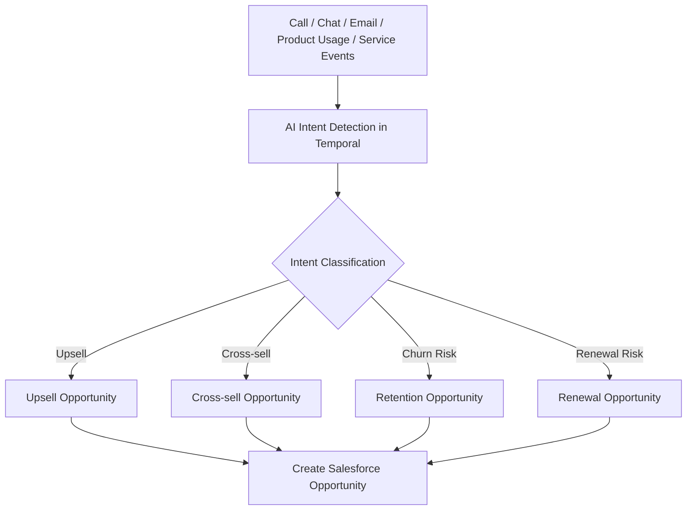

### Key correction:

✔ Opportunity is created early
✔ Campaign is NOT created at this stage

---

# 5. Opportunity as Revenue Intelligence Object

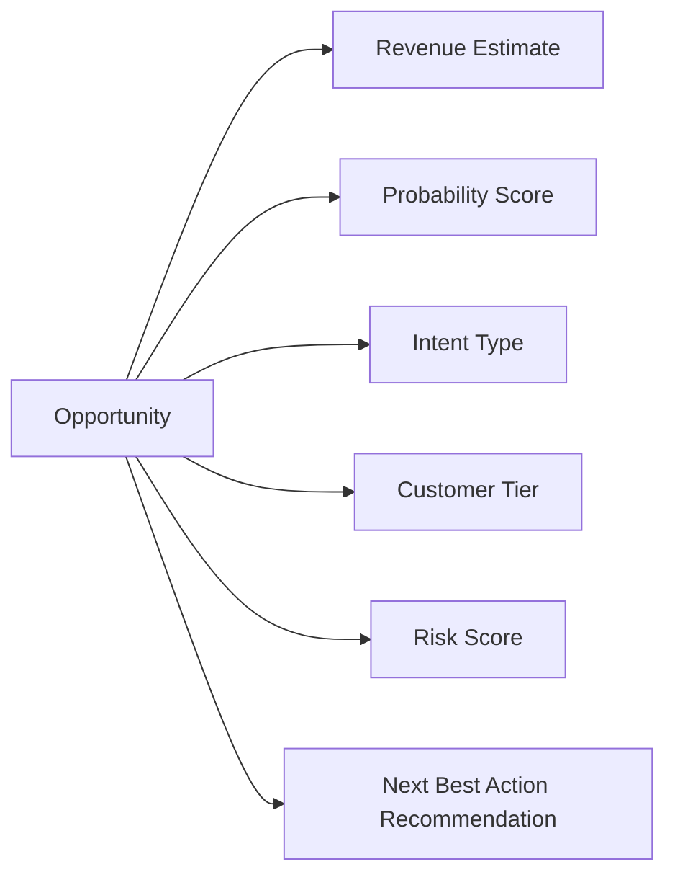

### Key idea:

Opportunity = **AI-enriched revenue decision object**

---

# 6. Opportunity → Revenue Strategy Recommendation (NOT Campaign Creation)

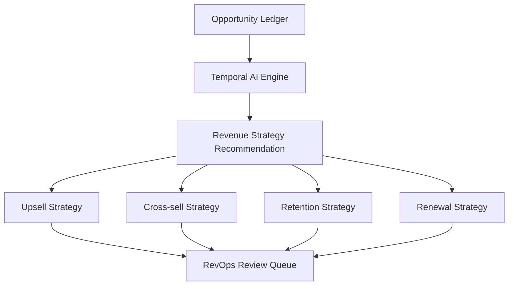

### Important correction:

❌ No automatic campaign creation
✔ Only **recommendations generated**

---

# 7. Human-in-the-Loop RevOps Approval (Critical Layer)

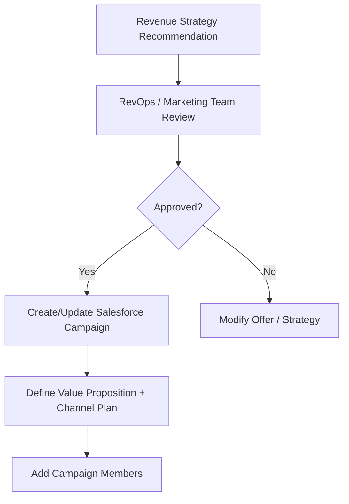

### Key correction:

✔ Humans control:

* discount strategy
* offer design
* campaign activation

---

# 8. Campaign Execution (via Marketing Cloud)

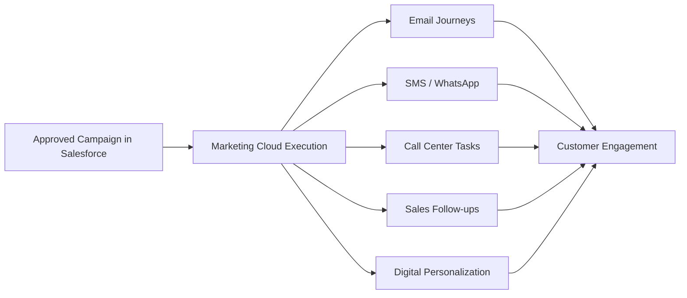

Salesforce Marketing Cloud

### Key correction:

✔ Campaign = execution layer only
❌ Not decision engine

---

# 9. Campaign Member + Campaign Influence Model (Correct Salesforce Semantics)

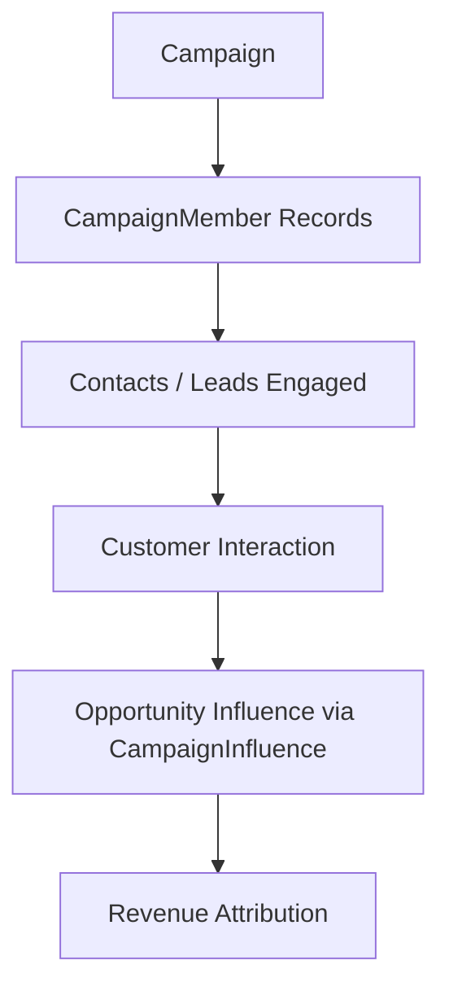

### Key correction:

* CampaignMember = audience participation
* CampaignInfluence = revenue attribution (NOT execution)

---

# 10. Personalized Value Proposition Engine (Controlled by RevOps)

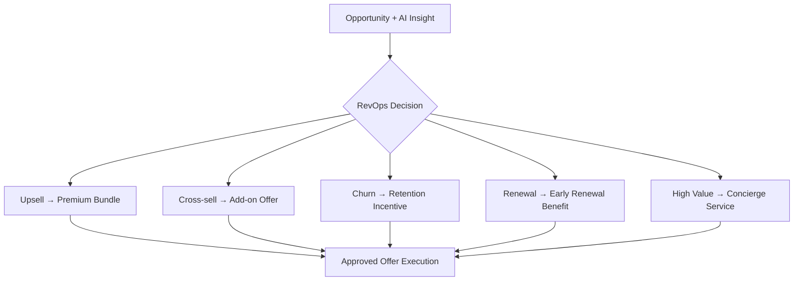

### Key principle:

✔ No automated discounting
✔ Margin protection enforced by human governance

---

# 11. Closed-Loop Revenue Tracking

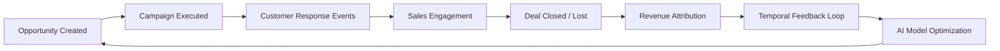

Temporal

---

# 12. Full End-to-End Architecture (Enterprise View)

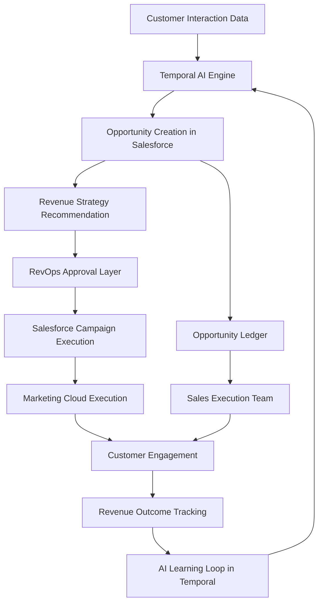

---

# 13. Final Positioning Statement (Correct Enterprise Version)

> “This architecture enables AI-driven revenue orchestration where Temporal detects customer intent, creates enriched Opportunities in Salesforce, generates revenue strategy recommendations, and routes them through a human RevOps approval process before execution via Salesforce Campaigns and Marketing Cloud. This ensures controlled, high-margin, and highly personalized revenue optimization across the customer lifecycle.”

---

# 14. What is now fixed (important)

### ✔ Corrected:

* Campaign is NOT auto-created
* Opportunity is NOT enrolled into Campaign
* Human approval layer added
* Campaign execution separated from decisioning
* Salesforce object model is accurate
* Marketing Cloud role correctly scoped
* Temporal role properly limited to orchestration + intelligence

---