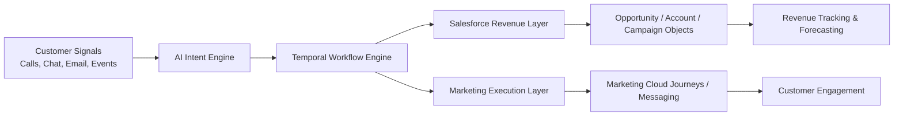
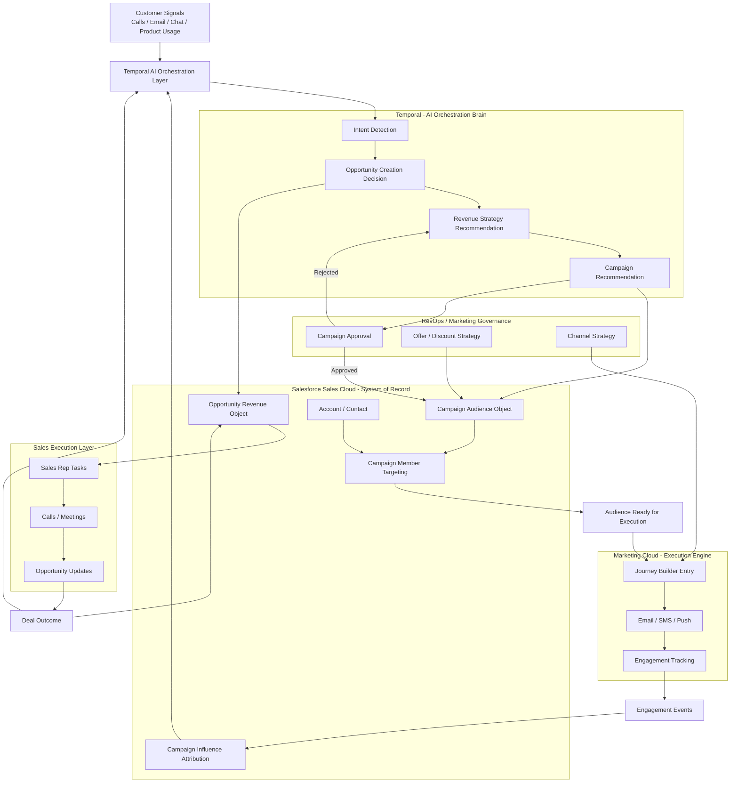
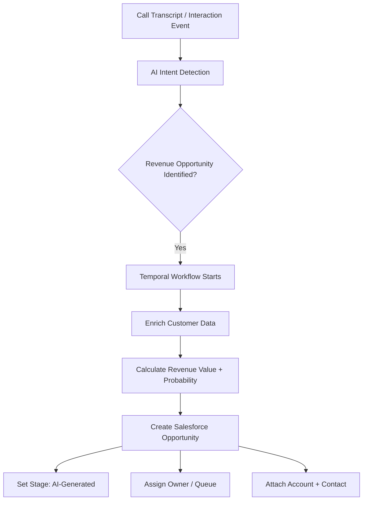
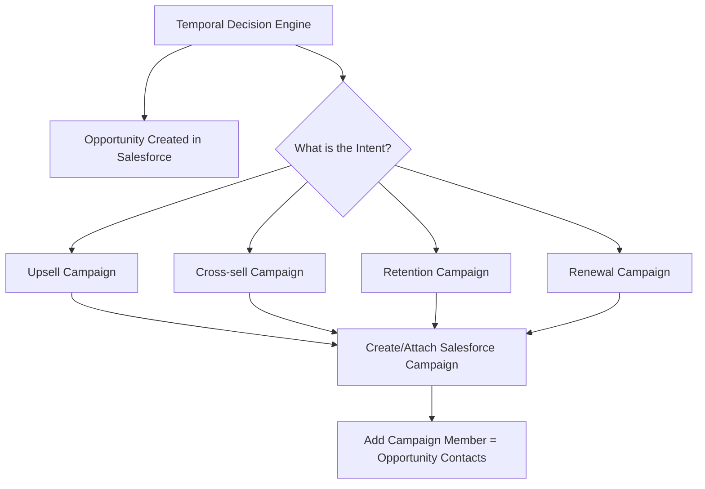
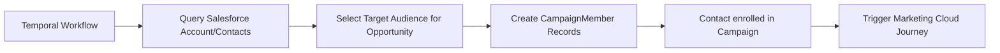
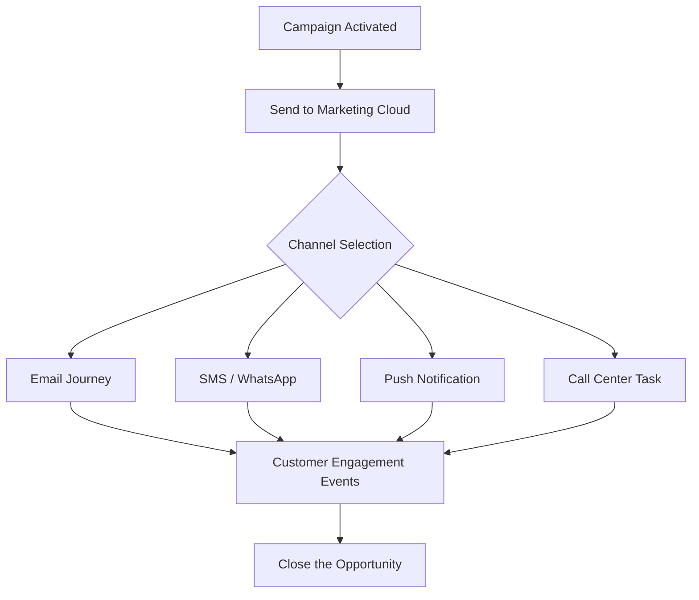
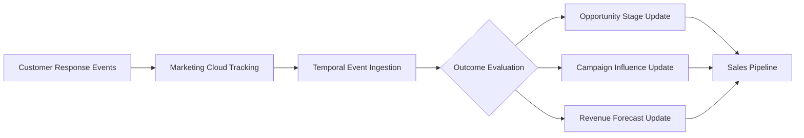
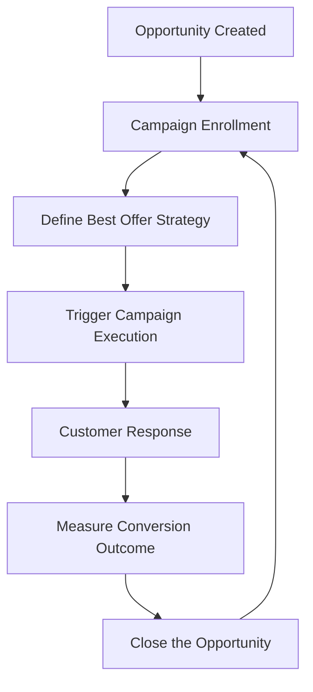
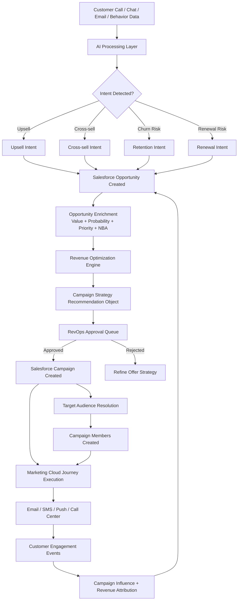
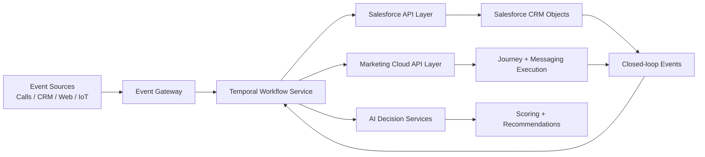

## AI-Driven Revenue Acceleration Model

This solution transforms customer interactions into revenue opportunities in real time and automatically determines the best way to convert them into sales.

---

## How it works (simple flow)

### Step 1 — Capture customer signals

We continuously capture customer interactions such as:

* Calls
* Emails
* Chat conversations
* Product usage behavior

---

### Step 2 — Understand customer intent using AI

AI analyzes these interactions to detect real business intent such as:

* Upsell opportunities
* Cross-sell potential
* Churn risk
* Renewal opportunity

---

### Step 3 — Automatically create revenue opportunities

When strong intent is detected, the system automatically creates a structured revenue opportunity in Salesforce.

This ensures:

* No opportunity is missed
* Revenue pipeline is created in real time
* Sales teams act earlier

---

### Step 4 — Decide the best action (Next Best Action)

The system then determines the best way to win the opportunity:

* Best offer (discount, bundle, upgrade, service)
* Best channel (email, SMS, sales call)
* Best timing
* Best message

This ensures we maximize conversion while protecting margins.

---

### Step 5 — Execute customer engagement

Engagement is executed through campaigns and journeys in Salesforce Marketing Cloud:

* Personalized emails
* SMS / notifications
* Sales follow-ups
* Automated journeys

---

### Step 6 — Continuous feedback and optimization

Customer responses are tracked and fed back into the system:

* Opportunity status is updated
* Campaign effectiveness is measured
* AI models improve over time

---

## Business outcomes

This approach delivers:

* Faster opportunity creation (real-time)
* Higher conversion rates (better targeting)
* Reduced discount leakage (smarter offers)
* Increased revenue per customer
* Lower manual effort for sales and marketing teams

---

## One-line summary

> “We use AI to convert customer conversations into revenue opportunities and automatically determine the best action to close them faster with optimized offers and minimal manual effort.”

---
# 1. Revenue Management Operating Model - Architecture Overview
**Temporal-based intelligent business process automation layer** to Salesforce revenue objects and marketing systems like Salesforce Marketing Cloud.

Temporal orchestrates AI-driven workflows where LLM-detected customer intent is validated and converted into Salesforce Opportunities, and then Next Best Action logic determines campaign or journey enrollment to execute personalized engagement strategies that improve conversion speed and maximize revenue through optimized value propositions.



### Core idea:

* **Temporal = brain + orchestration**
* **Salesforce = system of record**
* **Marketing Cloud = execution engine**

### High level System Architecture (Enterprise View)

---

# 2. Opportunity Creation Flow (AI → Revenue Object)

This is your **most important revenue path**.



### Salesforce mapping:

* Opportunity = primary revenue object
* Created by Temporal (not manually by sales)

---

# 3. Campaign as “Execution Layer for Opportunity”

This is your **reverse marketing model** (very important conceptually).



### Salesforce mapping:

* Campaign = execution container
* CampaignMember = linkage to Contacts/Leads
* Temporal decides “which campaign strategy”

---

# 4. Campaign Member Enrollment (Automation Logic)

This answers your earlier SAP-like mapping question.



### Key point:

Temporal replaces:

* manual “Add to Campaign”
* static segmentation
* report-based inclusion

---

# 5. Marketing Cloud Execution Flow



### Salesforce mapping:

* Marketing Cloud = execution engine
* Temporal = monitors outcomes

---

# 6. Closed-Loop Revenue Tracking (Very Important)



### Salesforce objects updated:

* Opportunity.Stage
* Campaign Influence
* Activities / Tasks
* Forecasting tables

---

# 7. Opportunity → Campaign Feedback Loop (Optimization System)



### Key concept:

This is a **self-learning revenue optimization loop**

---

# 8. end to end process flow



---

# 9. Business Interpretation (What You Tell Clients)

This architecture enables:

### 1. Revenue-first CRM

* Opportunities are created from real customer intent
* Not from marketing guesswork

### 2. Marketing becomes execution engine

* Campaigns are not discovery tools
* They are conversion accelerators

### 3. AI-driven personalization at scale

* Each opportunity gets a unique value proposition
* No blanket discounts

### 4. Closed-loop learning system

* Every interaction improves future revenue decisions

---

# 10. One-line Executive Summary

> “Temporal acts as the intelligent revenue orchestration layer that converts AI-detected customer intent into Salesforce Opportunities and dynamically drives Campaign execution through Marketing Cloud to maximize revenue per customer with closed-loop optimization.”

---
# 1. Implementation Target Architecture (Production View)
Below is a **production-level reference design** for integrating Temporal with Salesforce APIs and Salesforce Marketing Cloud.

This is written as something you could actually hand to an engineering team.



---

# 2. Core Design Principle

### Temporal is the “system of orchestration truth”

It controls:

* when Salesforce is called
* what gets created (Opportunity, Campaign, CampaignMember)
* retries + idempotency
* business sequencing
* compensation logic

### Salesforce is NOT the orchestrator

It is:

* system of record
* UI + reporting layer
* execution persistence

---

# 3. Salesforce API Layer Mapping

## 3.1 Opportunity APIs

### Create Opportunity

```http
POST /services/data/v62.0/sobjects/Opportunity/
```

**Payload**

```json
{
  "Name": "AI Upsell - Premium Plan",
  "AccountId": "001xx000003DGbY",
  "StageName": "Qualification",
  "Amount": 1200,
  "CloseDate": "2026-07-30",
  "LeadSource": "AI_Intent_Engine",
  "Description": "Created from call transcript AI detection"
}
```

---

### Update Opportunity Stage

```http
PATCH /services/data/v62.0/sobjects/Opportunity/{id}
```

---

### Query Opportunity

```http
GET /services/data/v62.0/query?q=SELECT+Id,StageName,Amount+FROM+Opportunity+WHERE+Id='...'
```

---

## 3.2 Campaign APIs

### Create Campaign

```http
POST /services/data/v62.0/sobjects/Campaign/
```

```json
{
  "Name": "Upsell Premium - AI Cluster",
  "Type": "AI_Orchestrated",
  "Status": "In Progress",
  "StartDate": "2026-05-15"
}
```

---

## 3.3 Campaign Member APIs (Critical)

### Add Contact to Campaign

```http
POST /services/data/v62.0/sobjects/CampaignMember/
```

```json
{
  "CampaignId": "701xx000000ABC",
  "ContactId": "003xx000004XYZ",
  "Status": "Sent"
}
```

---

## 3.4 Campaign Influence (Revenue Attribution)

```http
POST /services/data/v62.0/sobjects/CampaignInfluence/
```

Used when:

* multiple campaigns influence one Opportunity

---

## 3.5 Composite API (Performance Optimization)

For batching:

```http
POST /services/data/v62.0/composite
```

Used for:

* bulk opportunity + campaign + member creation
* reducing API calls from Temporal

---

# 4. Marketing Cloud API Mapping

## 4.1 Trigger Journey Entry

```http
POST /interaction/v1/events
```

```json
{
  "ContactKey": "003xx000004XYZ",
  "EventDefinitionKey": "AI_OPPORTUNITY_TRIGGER",
  "Data": {
    "OpportunityId": "006xx000001ABC",
    "IntentType": "UPSELL"
  }
}
```

---

## 4.2 Send Email / SMS via API

Email send (REST):

```http
POST /messaging/v1/messageDefinitionSends/key:EMAIL_DEFINITION/send
```

---

## 4.3 Data Extension Update

Used for segmentation + state sync:

```http
POST /data/v1/async/dataextensions/key:AI_OPPORTUNITIES/rows
```

---

# 5. Temporal Workflow Design (Production Grade)

---

# 5.1 Main Workflow: RevenueOrchestrationWorkflow

```python
@workflow.defn
class RevenueOrchestrationWorkflow:

    @workflow.run
    async def run(self, event):
        opportunity = await workflow.execute_activity(
            create_opportunity_in_salesforce,
            event
        )

        campaign = await workflow.execute_activity(
            create_or_get_campaign,
            opportunity
        )

        await workflow.execute_activity(
            attach_campaign_members,
            opportunity,
            campaign
        )

        await workflow.execute_activity(
            trigger_marketing_cloud_journey,
            opportunity
        )

        await workflow.execute_activity(
            monitor_outcomes_and_update,
            opportunity
        )
```

---

# 5.2 Activity 1 — Create Opportunity

```python
async def create_opportunity_in_salesforce(event):
    payload = {
        "Name": event.intent_name,
        "AccountId": event.account_id,
        "StageName": "AI_CREATED",
        "Amount": event.estimated_value,
        "CloseDate": event.expected_close_date,
        "LeadSource": "Temporal_AI"
    }

    return salesforce_api.post("/sobjects/Opportunity/", payload)
```

---

# 5.3 Activity 2 — Campaign Decision Logic

```python
async def create_or_get_campaign(opportunity):

    if opportunity.intent_type == "UPSELL":
        campaign_name = "Upsell Conversion Campaign"

    elif opportunity.intent_type == "CHURN":
        campaign_name = "Retention Save Campaign"

    elif opportunity.intent_type == "CROSS_SELL":
        campaign_name = "Cross Sell Expansion Campaign"

    return salesforce_campaign_api.upsert(campaign_name)
```

---

# 5.4 Activity 3 — Campaign Member Enrollment

```python
async def attach_campaign_members(opportunity, campaign):

    contacts = salesforce_api.query_contacts(opportunity.account_id)

    for contact in contacts:
        salesforce_api.post("/sobjects/CampaignMember/", {
            "CampaignId": campaign.id,
            "ContactId": contact.id,
            "Status": "Added_By_Temporal"
        })
```

---

# 5.5 Activity 4 — Trigger Marketing Cloud Journey

```python
async def trigger_marketing_cloud_journey(opportunity):

    payload = {
        "ContactKey": opportunity.contact_id,
        "EventDefinitionKey": "OPP_TRIGGER",
        "Data": {
            "OpportunityId": opportunity.id,
            "Type": opportunity.intent_type,
            "Value": opportunity.amount
        }
    }

    marketing_cloud_api.post("/interaction/v1/events", payload)
```

---

# 5.6 Activity 5 — Outcome Monitoring Loop

```python
async def monitor_outcomes_and_update(opportunity):

    while not opportunity.closed:

        event = await temporal.wait_for_event("MARKETING_RESPONSE")

        if event.converted:
            salesforce_api.update_opportunity(
                opportunity.id,
                {"StageName": "Closed Won"}
            )

        elif event.no_response_timeout:
            escalate_campaign(opportunity)
```

---

# 6. Reliability Design (Critical for Production)

## 6.1 Idempotency Key Strategy

Every Salesforce call includes:

* `ExternalId__c = TemporalWorkflowId`

Prevents duplicates.

---

## 6.2 Retry Policy

Temporal Activity retry:

* exponential backoff
* max retries: 5–10
* retry only safe operations (create/update, not payments)

---

## 6.3 Compensation Pattern (Saga)

If Campaign creation fails:

```text
Rollback Opportunity OR mark as "orphaned AI opportunity"
```

If Marketing Cloud fails:

```text
Retry + fallback to email queue system
```

---

## 7. Event-Driven Feedback Loop

Salesforce → Temporal

* Opportunity stage change
* Campaign response
* Email click
* Call outcome

Sent via:

* Salesforce Platform Events
* Webhooks
* CDC (Change Data Capture)

---

# 8. Final Enterprise Interpretation

This design makes:

### Temporal

→ intelligent revenue brain (decision + orchestration)

### Salesforce

→ system of record (Opportunity, Campaign, attribution)

### Marketing Cloud

→ execution engine (customer engagement)

---

# One-line architecture summary

> “Temporal orchestrates AI-driven revenue decisions and synchronizes Salesforce Opportunities and Campaigns while Marketing Cloud executes personalized engagement in a closed-loop revenue optimization system.”

---


